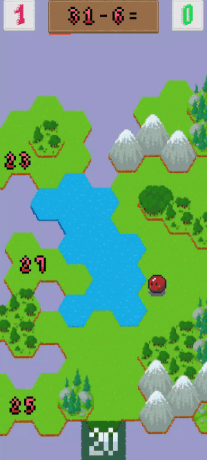
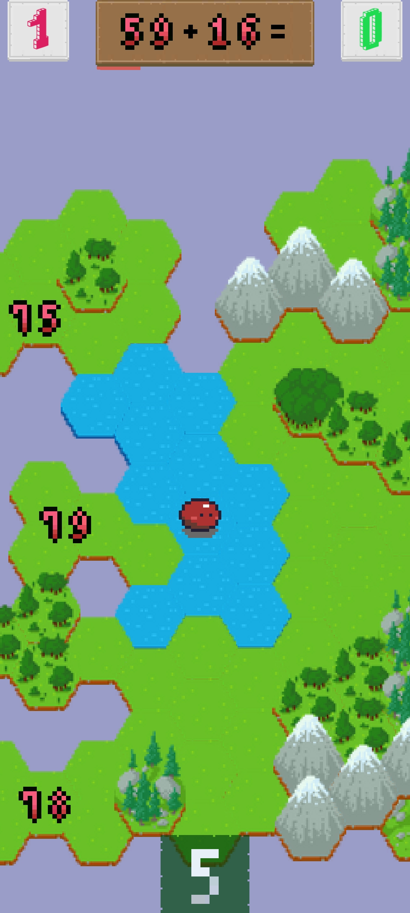
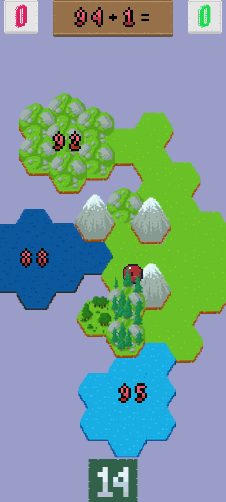
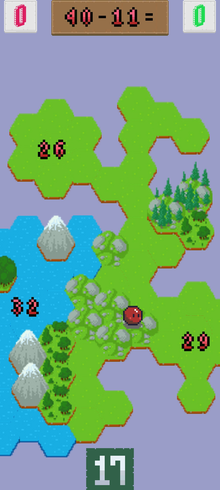
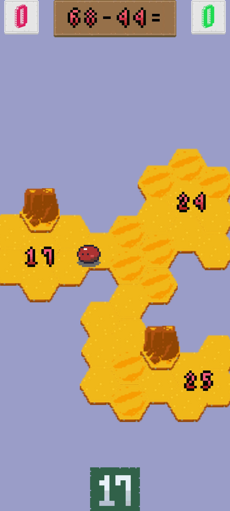
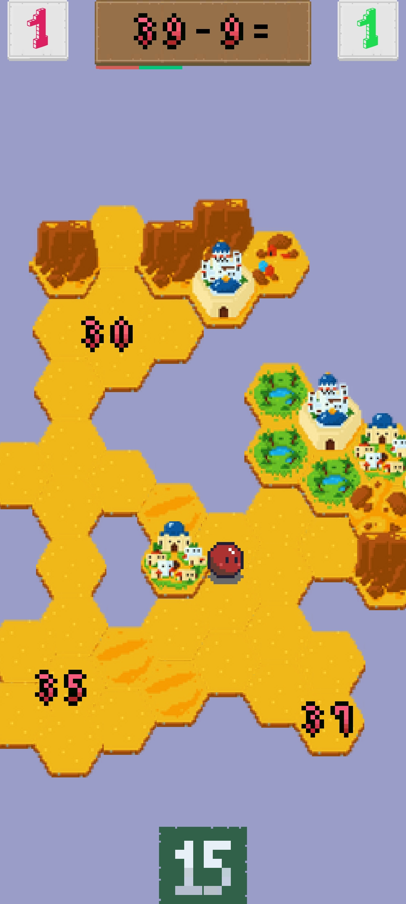
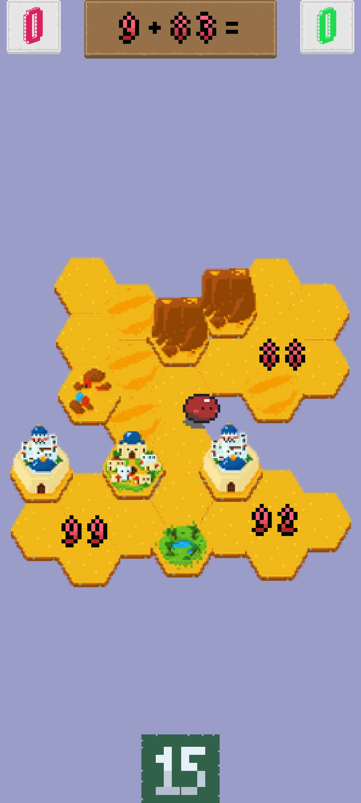

# Jam

This is an educational game, built with Unity Engine. It was created during a hackathon and has been polished since then. 
The game includes multiple levels and various game mechanics. It was built based on the [Squareball](https://github.com/lnadi17/squareball) repository, 
which served as a prototype for this project.

The gameplay consists of tilting the phone to move the ball character across the hexagonal map. 
On top of the screen, arithmetical questions are generated and possible answers are spawned on the map. 
The player must touch the correct answer while avoiding falling off the map. 
The different types of grounds, such as ice or rocky ground, affect the player's movement speed. 
Each level has a time limit, and currently, there are 6 different maps that are rotated infinitely.

## Instructions
The game can be played on Android by installing the `build.apk` file from the repository root. 
It can also be played in Unity Engine itself. 

## Screenshots

  
  
   
   
   
   

## Future Development
There are no plans for further development of this game. However, all assets can be freely used by others.
